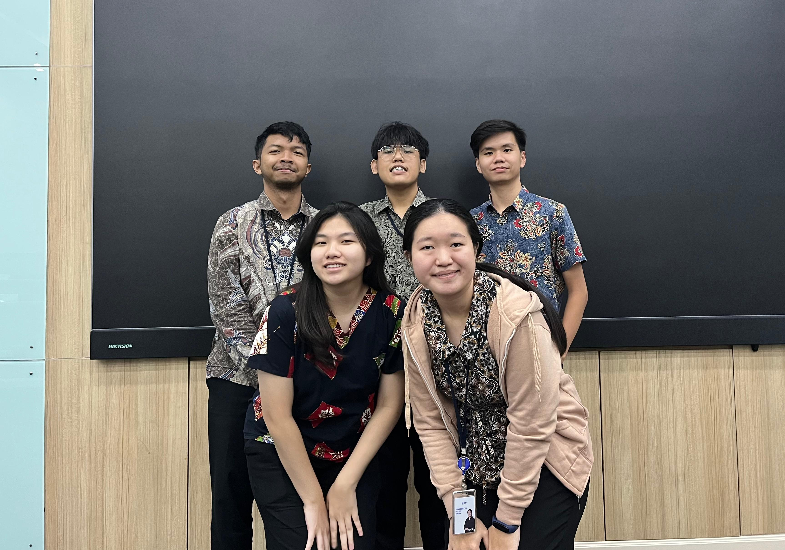

# Kainara

**Kainara** is an e-commerce application that sells traditional Indonesian fabrics and clothing made from those fabrics. The platform promotes the preservation of local culture while making it easier for customers to discover and purchase traditional fabric-based products online.

This project was developed as part of the **Web Programming** and **Agile Development** courses at BINUS University.

## ✨ Features

Kainara provides a rich set of functionalities across its pages:

### 🏠 Home (Landing Page)
-   Main visual and tagline
-   Showcase of product catalogs & UMKM stories
-   Customer testimonials

### 🔐 User Management
-   User registration & role-based login
-   Profile viewing & editing
-   Account management & logout

### 🛍️ Nusantara Fabric Marketplace
-   Comprehensive fabric catalog with product info
-   Advanced filtering (type, region, color, motif philosophy)
-   "Ready Stock" labels
-   Curation & rating system

### 📜 Story Behind the Fabric (Product Detail)
-   Dedicated detail page for each fabric: origin, motif philosophy, creation process, artisan story

### 👗 Custom Design & Consultation
-   Direct fabric selection & clothing design interaction (via WhatsApp)
-   Detailed body measurement input form

### 🤝 MSME Collaboration (Artisan Onboarding)
-   "Join as an Artisan" page for easy registration
-   Simplified fabric upload form for artisans

### 🛒 Checkout & Order Tracking
-   Multiple payment methods
-   Real-time order status & shipment tracking

### 📚 Education & Culture Blog
-   Articles on fabric history, traditional styles, and care tips

### ⚙️ Admin Panel (New)
-   **Dashboard**: Overview of system activities (e.g., sales, users, orders).
-   **User Management**: Manage all user accounts (customers, artisans, admins).
-   **Product Management**: Add, edit, or delete fabric products.
-   **Order Management**: View and update order statuses.
-   **Content Management**: Manage blog articles and static pages.

## 🛠️ Technologies Used

[](https://laravel.com/)
[](https://getbootstrap.com/)
[](https://tailwindcss.com/)
[](https://www.mysql.com/)

## 🚀 How to Run This Project

### Prerequisites

Before running this project, ensure you have the following installed:

-   [PHP >= 8.2](https://www.php.net/downloads.php) (Laravel 11 requires PHP 8.2 or higher)
-   [Composer](https://getcomposer.org/download/)
-   MySQL Server

### Installation Steps

1.  Clone the repository:
    ```bash
    git clone [https://github.com/username/kainara.git](https://github.com/username/kainara.git)
    cd kainara
    ```
2.  Install Laravel Dependencies:
    ```bash
    composer install
    ```
3.  Create a .env file and configure your database:
    ```bash
    cp .env.example .env
    php artisan key:generate
    ```
4.  Run migrations and seeders:
    ```bash
    php artisan migrate --seed
    ```
5.  Start the local development server:
    ```bash
    php artisan serve
    ```

## 👥 Contributors
<div align="center">  <p><i>Group 3 (AFAMYS) - BINUS University</i></p> </div>

- Angelina Joyvina C. S. — 2702363733
- Arya Maulana Shodiqi — 2702363746
- Fransiska Fu — 2702363891
- Michael Kurniawan — 2702363992
- Yosua Sugihartono — 2702364276

This project was developed collaboratively using the Agile (Scrum) methodology.
